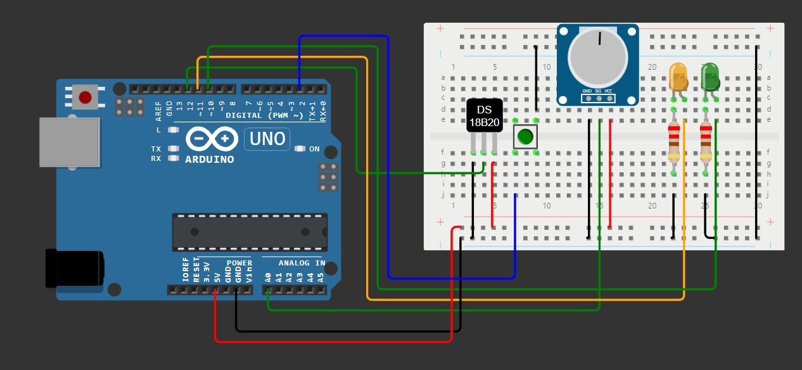

# HydroSense

HydroSense é um projeto desenvolvido para monitorar a temperatura e o pH do mar utilizando um sensor de temperatura DS18B20 e um potenciômetro em substituição ao sensor de pH. O projeto, inicialmente simulado no [Wokwi](wokwi-project.txt) é baseado em uma placa Arduino Uno e foi criado para facilitar o monitoramento em tempo real através de um monitor serial ou de um modo de saída específico para integração com o [HydroSense-graph](https://github.com/Mats057/HydroSense-graph).


## Sumário

- [Introdução](#introdução)
- [Importância do Projeto](#importância-do-projeto)
- [Componentes e Conexões](#componentes-e-conexões)
- [Requisitos](#requisitos)
- [Instalação e Configuração](#instalação-e-configuração)
- [Uso](#uso)
- [Integrantes](#integrantes)

## Introdução

Este projeto visa fornecer uma solução para o monitoramento de parâmetros ambientais do mar, especificamente a temperatura e o pH. A ausência de um sensor de pH real foi contornada utilizando um potenciômetro para simular as leituras de pH.

## Importância do Projeto

A vida dos organismos aquáticos depende criticamente do pH da água. O pH ideal é crucial para o bem-estar dos organismos marinhos, pois desvios significativos dessa faixa podem causar estresse fisiológico, afetando a respiração, reprodução e outras funções vitais. Em casos extremos, pH muito baixo ou muito alto pode ser fatal para diversas espécies.

Além disso, níveis inadequados de pH podem alterar a disponibilidade de nutrientes essenciais para o ecossistema marinho. Isso compromete a saúde de microorganismos, plantas aquáticas e influencia a composição das comunidades de algas e fitoplâncton. Essas mudanças podem ter um efeito cascata, afetando toda a cadeia alimentar marinha e a biodiversidade.

Portanto, o monitoramento contínuo e preciso da temperatura e do pH é fundamental para a conservação dos ecossistemas aquáticos. Projetos como o HydroSense permitem que cientistas e ambientalistas acompanhem as condições ambientais em tempo real, respondendo rapidamente a quaisquer alterações que possam ameaçar a vida marinha. Isso contribui para a preservação da biodiversidade e o equilíbrio dos ecossistemas marinhos.

## Componentes e Conexões

### Componentes Necessários

- Arduino Uno
- Sensor de temperatura DS18B20
- Potenciômetro
- LEDs (laranja e verde)
- Resistores de 220 ohms
- Botão push-button
- Breadboard e jumpers

### Diagrama de Conexões



Para ver as conexões com mais detalhes, por favor, entre na simulação do projeto com o Wokwi **[aqui](https://wokwi.com/projects/399317592880947201)** ou consulte o arquivo `diagram.json`.

## Requisitos

Para reproduzir este projeto, você precisará dos seguintes itens:

### Hardware

- Placa Arduino Uno
- Sensor de temperatura DS18B20
- Potenciômetro
- LEDs e resistores
- Botão push-button
- Breadboard e jumpers

### Software

- [Arduino IDE](https://www.arduino.cc/en/software)
- Bibliotecas Arduino:
  - OneWire
  - DallasTemperature

## Instalação e Configuração

1. **Clone o Repositório:**

   ```bash
   git clone https://github.com/Mats057/HydroSense-graph.git
   cd HydroSense-graph
   ```

2. **Instale as Bibliotecas Necessárias:**

   Abra o Arduino IDE e vá para `Sketch > Include Library > Manage Libraries`. Instale as bibliotecas OneWire e DallasTemperature.

3. **Carregue o Código para o Arduino:**

   Abra o arquivo `sketch.ino` no Arduino IDE, selecione a placa correta e a porta em `Tools`, e então carregue o código para a placa.

## Uso

### Operação Básica

1. **Inicialização:**

   Após carregar o código, o Arduino começará por padrão a monitorar a temperatura e o pH (simulado pelo potenciômetro) e exibir as leituras no monitor serial. Caso você esteja usando o [HydroSense-graph](https://github.com/Mats057/HydroSense-graph), você pode alternar para o modo Python **(LED LARANJA)** para ocorrer a integração de forma correta.

2. **Alternando Modos:**

   Pressione o botão push-button para alternar entre o modo normal e o modo Python. O LED verde acende no modo normal e o LED laranja acende no modo Python.

   - **Modo Normal:** Exibe as leituras de temperatura e pH no monitor serial.
   - **Modo Python:** Formata as leituras para a integração com o [HydroSense-graph](https://github.com/Mats057/HydroSense-graph).

### Exemplo de Saída

- **Modo Normal:**
  ```plaintext
  Temperatura = 25.00°C
  pH = 7.00
  ```

- **Modo Python:**
  ```plaintext
  25.00,7.00
  ```


## Integrantes

- [**Matheus Queiroz**](https://www.linkedin.com/in/matheus-zanutin/) - RM558801 
- [**Matheus Vinícius**](https://www.linkedin.com/in/matheus-alves-8471942b1/) - RM555177
- [**Marcela Torro**](https://www.linkedin.com/in/marcela-torro-b98a50237/) - RM557658
